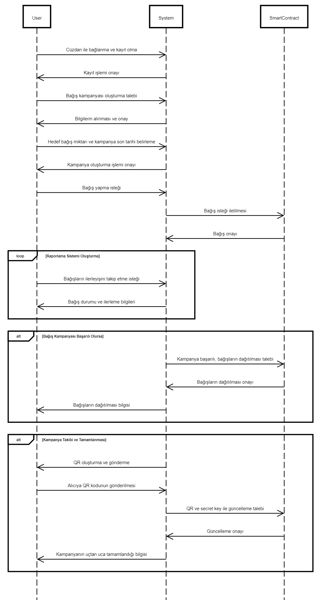

<h1>IAMCN - International Aid Monitoring Charity Network  </h1>

 

  

[İngilizce](README-en.md)
[Türkçe](README-en.md)

## Amaç
IAMCN, insanların katkılarını şeffaf bir şekilde izleyebilmek ve hedeflerine ulaşmasını sağlamak amacıyla geliştirilen bir Web3 projesidir. Temel hedef, Web3 teknolojilerini kullanarak bağışları güven altına almak, küresel ölçekte bağış oranlarını artırmak ve herhangi bir yanlış anlaşılmanın önüne geçmektir.

Projemizin odak noktası, katkıda bulunanların bağışlarının her aşamasını izleme ve şeffaf bir şekilde sunma çabasıdır. Web3 teknolojisinin sunduğu güvenilirlik ve şeffaflık ile bağış süreçlerini adil, güvenli ve izlenebilir hale getirerek, bağış yapanlar arasında güven oluşturmayı amaçlıyoruz.

Platformumuz, her adımın kayıt altına alındığı, kullanıcıların bağışlarını takip edebildiği ve bağışlanan kaynakların hedeflere ne şekilde ulaştığını açıkça görebildiği yenilikçi bir yapı sunmaktadır. Bu sayede, bağış yapmak isteyenlerin güvenini sağlayarak bağış kültürünü geliştirmeyi hedefliyoruz.

## Kapsam

Projemizin kapsamı, omChain üzerinde işleyen akıllı bir kontrat üzerine odaklanmaktadır. Geliştirdiğimiz smart contract, web sitesi aracılığıyla bağışların şeffaf bir şekilde OMC olarak alınmasını ve iletilmesini sağlamaktadır.

Bu kapsamda, oluşturduğumuz akıllı kontrat, bağış sürecini omChain üzerinde şeffaf bir şekilde yönetmek üzere tasarlanmıştır. Kullanıcılar, web sitesi üzerinden gerçekleştirdikleri bağışları bu akıllı kontrat ağı üzerinden güvenilir bir şekilde gerçekleştirir ve bağışlanan fonların takibini yapabilirler.

Hedeflediğimiz kapsam, bağış sürecinin her aşamasını şeffaf ve güvenilir bir şekilde yöneterek, kullanıcıların güvenini sağlamak ve bağışların OMC üzerinden güvenle iletilmesini temin etmektir.

## Fikir Özeti

IAMCN, omChain ağı üzerinde güvenli bir akıllı kontrat aracılığıyla destekçilerin kampanyalara kripto bağış yapmalarını kolaylaştırmak ve bu bağışların şeffaf bir şekilde izlemesini sağlayan web3 tabanlı bir platformdur. Temel hedef, bağış süreçlerini şeffaf, güvenilir ve izlenebilir hale getirerek, kullanıcıların güvenini sağlamak ve küresel çapta bağış oranlarını artırmaktır.

## Misyon

Misyonumuz, Web3 teknolojileriyle donatılmış bir platform aracılığıyla bağış süreçlerini baştan sona şeffaf ve güvenilir bir hale getirmektir. Kullanıcıların yaptığı bağışların her adımını izleyebildiği, güvenilir bir akıllı kontrat ile bu bağışların yönetildiği bir ortam oluşturmayı amaçlıyoruz.

Bağış yapanların, bağışlarına dair herhangi bir belirsizlik olmadan, tamamen şeffaf bir biçimde izleyebilmeleri ve nihai hedefe ulaşan katkılarını görebilmeleri bizim için önemli. Bu doğrultuda, kullanıcıların bağıştaki güvenini sağlayarak bağış kültürünü daha sağlam bir temel üzerine inşa etmeyi hedefliyoruz.

## Vizyon

Vizyonumuz, dünya genelinde bağış oranlarını artırmak ve bağış süreçlerini daha adil, izlenebilir ve etkili hale getirmektir. Bağış kültürünü destekleyen, şeffaflığı temel alan ve güveni esas alan bir platform oluşturarak toplumsal faydaya katkı sağlamak istiyoruz.

Bu misyon ve vizyon doğrultusunda, bağışların değerini artırmak, bağış yapanlarla bağış alanlar arasında köprü oluşturmak ve herkesin daha etkin ve anlamlı bağışlar yapabilmesini sağlamak için çalışıyoruz. Herkesin katkıda bulunabileceği, şeffaf ve güvenilir bir bağış ekosistemi oluşturma amacıyla yolumuza devam ediyoruz.

## İş Akışımız

### **1. Kullanıcı Kayıt Olması**

İlk adım, kullanıcıların dapp'e cüzdanları ile bağlanmasını sağlamaktır. Bu, kullanıcıların bağış yapabilmeleri ve bağış toplama kampanyalarına katılabilmeleri için gereklidir. Sistemimize ulaşan herhangi bir potansiyel bağışçı, cüzdanını bağlayarak sisteme kaydolur.

### **2. Bağış Toplama Kampanyası Oluşturma**

Bir sonraki adım, bağış toplama kampanyası oluşturmaktır. Bunun için sistemimiz üzerinden paraya ihtiyacı olan kurum ve kuruluşlar bize başvurarak bilgilerini 

iletir. Sonrasında kurum veya kuruluşun hedef bağış miktarı ve kampanyanın son tarihi belirlenir. Sistem, akıllı kontratın sahibi tarafından kampanya oluşturmayı sağlar ve böylece sistem üzerinde bulunan kampanyalar, owner tarafından gözlemlenir ve insanların iyi niyetlerinin sömürülmesi engellenir.

### **3. Bağış Yapma**

Kullanıcıların bağış yapmalarına izin vermek için bir bağış mekanizması oluşturulmalıdır. Bu, kullanıcıların omChain cüzdanlarından bağış yapmalarına olanak tanımalıdır.

### **4. Bağışları İzleme**

Bağışların nasıl ilerlediğini takip etmek için bir raporlama sistemi oluşturulmalıdır. Bu, kullanıcılara bağışlarının durumunu ve kampanyanın genel ilerlemesini görmelerine olanak tanımalıdır. Bu, tüm işlemlerin neler olduğu ve kimler tarafından gerçekleştiği gerektiğinde keşfedilebilir hale getirir.

### **5. Bağış Aktarma**

Kampanya başarılı olursa, bağışların kampanyanın amacına göre dağıtılması gerekmektedir. Bu, bağışların doğrudan alıcılara aktarılmasını veya bir hayır kurumu veya diğer kuruluşa bağışlanmasını içerebilir.

### **6. Kampanya Takibi ve Tamamlanması**

Kampanyanın ID'sini içeren bir QR oluşturulur. Sonrasında oluşturulan bu QR, taşıyıcıya wp api üzerinden gönderilir. Alıcı taşıyıcısının QR kodunu okuttuktan sonra kampanya validate sayfası açılır. Alıcı, QR kodla beraber oluşturulan secret key'i input olarak ekler. Bu ikili eşleşme sağlandığında akıllı kontrat güncellenir ve kampanyanın uçtan uca tamamlanması sağlanır.

## API

Sistem üzerinde kullanılan apilerin tasarımları hakkında bilgilendirmeler aşağıda verilmiştir.

## first-step.js:
[first-step.js](utils/first_step.js)

1.  **İstemci İstekleri (Client Requests):**
    
    -   Kullanıcı tarayıcıdan `/generateQRAndSendWhatsApp` endpoint'ine bir HTTP GET isteği gönderir.
    -   İstekte, kullanıcıdan üç parametre beklenir: `id`, `telno1`, ve `telno2`.
2.  **Express Sunucusu (Express Server):**
    
    -   `express` kütüphanesi kullanılarak bir Express sunucusu oluşturulur.
    -   Sunucu, `PORT` numarasına dinler ve gelen istekleri yönlendirir.
3.  **QR Kodu Oluşturma ve Dosyaya Yazma (QR Code Generation and File Writing):**
    
    -   `generateQRAndSendWhatsApp()` fonksiyonu, istemci tarafından gönderilen bilgilerle bir QR kodu oluşturur.
    -   `QRCode.toFile()` metodu ile QR kodu `qrcode.png` dosyasına yazılır.
    -   Ardından rastgele bir `secretKey` oluşturulur ve bu bilgi `id_secret.json` dosyasına yazılır.
4.  **WhatsApp İletişimi (WhatsApp Communication):**
    
    -   `axios` kütüphanesi aracılığıyla WhatsApp mesajları gönderilir.
    -   İlk olarak, QR kodu oluşturulan URL, `whatsapp-messaging-hub.p.rapidapi.com` adresine gönderilir. Bu adreste, belirtilen telefon numarasına QR kodu gönderilir.
    -   Daha sonra, `secretKey`, `telno2` olarak belirtilen diğer telefon numarasına gönderilir.
5.  **Hata Yönetimi (Error Handling):**
    
    -   Herhangi bir hata durumunda, `try...catch` blokları ile hatalar yakalanır ve konsola veya istemciye uygun mesajlar gönderilir.
6.  **Sunucu Yanıtları (Server Responses):**
    
    -   Sunucu, başarılı veya başarısız olma durumuna göre istemciye uygun HTTP yanıtları gönderir.

### Sistem Akışı:

1.  Kullanıcı, `/generateQRAndSendWhatsApp` endpoint'ine geçerli parametrelerle bir GET isteği gönderir.
2.  Express sunucusu bu isteği alır ve parametreleri kontrol eder.
3.  `generateQRAndSendWhatsApp()` fonksiyonu çağrılır ve QR kodu oluşturulur.
4.  QR kodu WhatsApp'a gönderilir ve belirtilen telefon numaralarına iletilir.
5.  Sonuçlar istemciye HTTP yanıtları ile gönderilir.

## second_step.js:
[second-step.js](utils/second_step.js)

1.  **Express Sunucusu (Express Server):**
    
    -   `express` kütüphanesi kullanılarak bir Express sunucusu oluşturulur.
    -   Sunucu, `port` numarasına dinler ve gelen istekleri yönlendirir.
2.  **Middleware:**
    
    -   `express.json()` middleware'i kullanılarak gelen istekler JSON formatına dönüştürülür.
3.  **Web3 Kontrat İşlemleri:**
    
    -   `sendContractRequest()` fonksiyonu, Thirdweb-SDK kullanarak Web3 kontratına istek gönderir.
    -   `ThirdwebSDK` ve `Omchain` kullanılarak bir SDK oluşturulur.
    -   Oluşturulan SDK ile belirtilen `CLIENT_ID` ile `CONTRACT_ADDRESS` üzerinde işlem yapılabilir.
4.  **`/validate` Endpoint'i:**
    
    -   HTTP POST istekleri için `/validate` endpoint'i tanımlanır.
    -   Bu endpoint, istemci tarafından gelen `id` ve `secret` parametrelerini kontrol eder.
    -   Eğer parametreler eksikse veya hatalıysa, uygun HTTP yanıtları gönderilir.
    -   `id_secret.json` dosyası okunur ve içeriği incelenir.
    -   Gelen `id` ve `secret`, dosyadaki verilerle karşılaştırılır.
    -   Eşleşme varsa, `sendContractRequest()` ile Web3 kontratına istek gönderilir.

### Sistem Akışı:

1.  Kullanıcı, `/validate` endpoint'ine HTTP POST isteği gönderir ve `id` ile `secret` parametrelerini sağlar.
2.  Express sunucusu, gelen isteği alır ve JSON formatına dönüştürür.
3.  Endpoint, `id` ve `secret` parametrelerini kontrol eder.
4.  `id_secret.json` dosyası okunur ve içeriği incelenir.
5.  Gelen `id` ve `secret`, dosyadaki verilerle karşılaştırılır.
6.  Eğer eşleşme varsa, `sendContractRequest()` fonksiyonu çağrılır ve Web3 kontratına istek gönderilir.
7.  Uygun yanıtlar kullanıcıya geri gönderilir.

## Sequence Diagram

Çizmiş olduğumuz diagram aşağıda verilmiştir.

## Loyality Sistemlerinin İnsan Üzerine Etkileri

Bağış toplama kampanyalarında, bağış yapan kişilere, bağışlarının karşılığında bir ödül verilebileceği belirtilmesi, bağış yapma ihtimalini artırmaktadır. Bu etki, kazancın büyüklüğüne ve bağışın zorluğuna bağlı olarak değişmektedir. Kazancın büyüklüğü, bağış yapmayı daha cazip hale getirmektedir. Bağış zorsa, kazanç daha büyük olmalı ki bağışı yapan kişi, harcadığı çabayı karşılayabilsin.

Bu etkiyi inceleyen araştırmalar, çeşitli ödül türlerinin bağış yapma ihtimalini artırdığını göstermiştir. Örneğin, bir araştırmada, bağış yapan kişilere, bağışlarının karşılığında bir hediye verileceği söylendiğinde, bağış yapma ihtimallerinin arttığı bulunmuştur. Başka bir araştırmada, bağış yapan kişilere, bağışlarının karşılığında bir çekilişe katılacakları söylendiğinde, bağış yapma ihtimallerinin arttığı bulunmuştur.

Bu araştırmalardan çıkarılabilecek bazı sonuçlar şunlardır:

- Bağış toplama kampanyalarında, bağış yapan kişilere, bağışlarının karşılığında bir ödül verilebileceği belirtilebilir.

- Bağış toplama kampanyalarında, bağışların zorluğunun, kazancın büyüklüğü ile orantılı olması sağlanabilir.

| Ödül Türü             | Ortalama Bağış Artışı (%) |
|-----------------------|---------------------------|
| Hediye                | 10-20                     |
| Çekiliş               | 20-30                     |
| Özel etkinlik daveti  | 25-35                     |
| Sosyal medya paylaşımı| 30-40                     |
| Ürün veya hizmet indirimi | 40-50                 |
| Özel hediyeler        | 50-60                     |

### Kaynak:

- "The Impact of Rewards on Donation Behavior" (2013), Journal of Consumer Research
- "The Effects of Lotteries on Donation Behavior" (2015), Journal of Marketing

